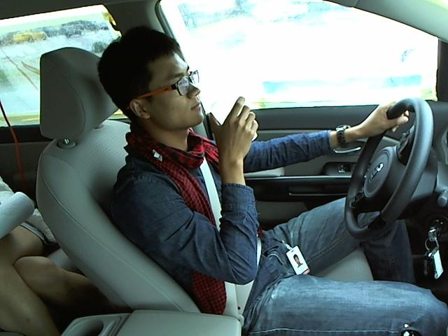

# 机器学习纳米学位
## 开题报告
潘超 Udacity  
2018年6月3日

## 报告内容
### 项目背景
生活中许多驾驶员喜欢一边开车一边做别的事情，如：打电话、发微信、吃东西、聊天、疲劳驾驶等等，安全隐患非常大。特别是一些大巴车司机，关乎到整个大巴车上几十个人的人身安全。

早期驾驶员状态检测方法主要是基于车辆运行状态的检测方法，包括车道偏离报警、转向盘检测等，对驾驶员本身的特征敏感度不高，容易因环境因素误判，也不能从根本上解决驾驶员状态检测的问题，而近年的基于深度学习的图像识别技术则提供了不错的解决办法，可以通过对视频图像进行分析检测驾驶员当前的状态并给予提醒，甚至在出现更严重的危险情况时通过车辆控制信号及时主动刹停汽车。

选择研究该项目也是因为自己也是一名驾驶员，经常开车载着一家人长途旅行，偶尔也会出现不安全的驾驶行为，也希望这方面的技术发展能带来一些汽车安全上的提升。
### 问题描述
处理通过车载摄像头记录到的驾驶员状态图像，对图像进行识别处理，分析图像中驾驶员当前所处的状态，以满足对安全驾驶提醒的需求。需要从图像中识别包括如下的驾驶员状态：
0. 安全驾驶
1. 右手打字
2. 右手打电话
3. 左手打字
4. 左手打电话
5. 调收音机
6. 喝饮料
7. 拿后面的东西
8. 整理头发和化妆
9. 和其他乘客说话
### 输入数据
数据集来源于往年的Kaggle竞赛。数据集中包含大量车载摄像头对驾驶员位置的摄影截图，可清楚看到驾驶员的各种行为，包括打电话、喝饮料、拿后面的东西、打字等。

数据集中将图片数据分为了训练集和测试集，训练集可用于该项目中训练模型，测试集可在模型训练完毕后检验预测效果，可提交至Kaggle中计算已训练模型的最终得分。

训练集中已将图像标记分类，分为c0到c9一共十个文件夹存放，共22424张图片。测试集中有79729张未标记分类的图片。训练数据中司机状态分类呈均匀分布：


数据集中每一张图片大小为640*480像素。图片中的驾驶员各种各样，有胖有瘦，有高有矮，有男有女、甚至还有不同肤色的驾驶员，有的驾驶员手臂上还有纹身。图片的光线有明，也有暗，甚至还有些有点爆光过度，导致难以发现手中的透明杯子。
1. 因光照原因看不见喝饮料的杯子  

2. 胖驾驶员  

3. 图像模糊  


项目开始时将对训练集做分割，分割出实际训练集和验证集，训练集用于该项目中训练模型，验证集用于对训练出的模型作验证，检验模型的泛化能力。这里因为数据集中的司机图像是从视频中截取出来的，可能存在两张甚至多种几乎一样的图像分别位于训练集和验证集中。训练后做验证时因为验证集存在几乎相同的图像，会导致验证分数被提高，但实际上模型仅仅是记住了该图片，因此分割验证集里需要采用一些策略。

通过分析数据集中提供的`driver_imgs_list.csv`文件发现，subject列中相同编码对应的图像是同一名司机，共有26名司机，且每一名司机都有c0到c9十种行为，为避免上诉问题出现，在使用KFold分割数据时，分割为13组数据，每一组中有2名司机的图像数据作为验证集。
### 解决办法
使用sklearn中的GroupKFold对数据集进行划分，划分时使用`subject`列中的数据作为分组依据，`img`列和`classname`列分别作为数据的特征和目标分类：
```python
drivers_pd = pd.read_csv("data/driver_imgs_list.csv")
imgs_pd = drivers_pd["img"]
class_pd = drivers_pd["classname"]
subject_pd = drivers_pd["subject"]
kfolds = group_kfold.split(imgs_pd, class_pd, subject_pd)
for train_index, test_index in group_kfold.split(imgs_pd, class_pd, subject_pd):
    print("TRAIN:", train_index, "TEST:", test_index)
```
可使用InceptionV3[1]和Xception[2]模型来训练数据集，使用imagenet的权重来初始化模型权重，尝试对两个模型进行fine-tune微调，在模型的最后增加一个全局平均池化层、一个全连接层，全连接层使用`softmax`激活函数进行分类，训练10种驾驶员状态。训练多次迭代，使用随机梯度下降优化法找到模型的最优参数，使损失函数降低到最优值。
### 基准模型
使用Kaggle中该项目的排名分数做为基准模型。使用前10%的分数作为基准，第144名，最小损失值为0.25634。
### 评估指标
评估指标使用kaggle中该项目的评估方式，即multi-class logarithmic loss，损失值计算公式：
$$
logloss = -\frac{1}{N}\sum_{i=1}^{N}\sum_{j=1}^{M}y_{ij}log(p_{ij})
$$
公式中$N$为图像的数量，用于训练集时为当前训练集的数量，用于验证集时为验证集的数量，测试集同理。$M$表示图像标记的数量，在该项目中$M$为10。$y_{ij}$为第$i$个图像在第$j$分类中的标记概率，如果图像为该类，则该值为1，否则为0。$log$为自然对数，$p_{ij}$为第$i$个图像在第$j$分类中标记的预测概率。将每一张图像每个分类的预测概率的自然对数与分类目标标记的积相加再取负均值，最终即为多分类损失值。
### 设计大纲
使用`pandas`库读取出`driver_imgs_list.csv`中的数据，获得一份相当于司机训练数据的索引。并使用`subject`列统计出司机唯一ID的总数量，使用2名司机的图像数据作为验证集。

从`driver_imgs_list.csv`中的图像索引划分出训练集和验证集并通过数据表中的`classname`列获取训练集和验证集的目标标记。

分别尝试使用Keras中的预训练模型InceptionV3[1]和Xception[2]，对训练集进行训练并验证。每一次epoch计算出训练集及验证集的损失值，同时使用优化器的训练历史数据绘制损失值折线图，研究哪一个模型的效果最优。
## 参考资料
[1]Christian Szegedy, Vincent Vanhoucke, Sergey Ioffe, Jonathon Shlens, Zbigniew Wojna. [
Rethinking the Inception Architecture for Computer Vision](https://arxiv.org/abs/1512.00567). arXiv:1512.00567, 2015.
[2]François Chollet. [Xception: Deep Learning with Depthwise Separable Convolutions](https://arxiv.org/abs/1610.02357). arXiv prepr int arXiv:1610.02357, 2016.
[3]黄文坚. [CNN浅析和历年ImageNet冠军模型解析](http://www.infoq.com/cn/articles/cnn-and-imagenet-champion-model-analysis). 发表时间: 2017年5月22日.
