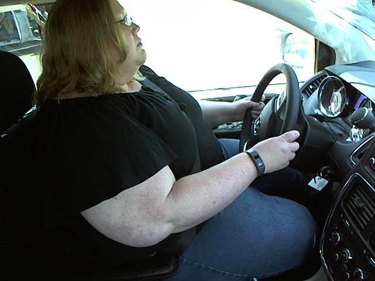

# 机器学习纳米学位
走神司机 潘超 优达学城  
2018年6月6日
## I. 问题的定义
### 项目概述
生活中许多驾驶员喜欢一边开车一边做别的事情，如：打电话、发微信、吃东西、聊天、疲劳驾驶等等，安全隐患非常大。特别是一些大巴车司机，关乎到整个大巴车上几十个人的人身安全。

早期驾驶员状态检测方法主要是基于车辆运行状态的检测方法，包括车道偏离报警、转向盘检测等，对驾驶员本身的特征敏感度不高，容易因环境因素误判，也不能从根本上解决驾驶员状态检测的问题，而近年的基于深度学习的图像识别技术则提供了不错的解决办法，可以通过对视频图像进行分析检测驾驶员当前的状态并给予提醒，甚至在出现更严重的危险情况时通过车辆控制信号及时主动刹停汽车。

选择研究该项目也是因为自己也是一名驾驶员，经常开车载着一家人长途旅行，偶尔也会出现不安全的驾驶行为，也希望这方面的技术发展能带来一些汽车安全上的提升。
### 问题陈述
处理通过车载摄像头记录到的驾驶员状态图像，对图像进行识别处理，分析图像中驾驶员当前所处的状态，以满足对安全驾驶提醒的需求。需要从图像中识别包括如下的驾驶员状态：
0. 安全驾驶
1. 右手打字
2. 右手打电话
3. 左手打字
4. 左手打电话
5. 调收音机
6. 喝饮料
7. 拿后面的东西
8. 整理头发和化妆
9. 和其他乘客说话
每一张图片识别出的结果应该是该图片分别在十种状态中的概率值，如安全驾驶的图片的理想识别结果应该为c0类别的概率为1，其他9种类别的概率为0。
### 评价指标
评估指标使用kaggle中该项目的评估方式，即multi-class logarithmic loss，损失值计算公式：
$$
logloss = -\frac{1}{N}\sum_{i=1}^{N}\sum_{j=1}^{M}y_{ij}log(p_{ij})
$$
公式中$N$为图像的数量，用于训练集时为当前训练集的数量，用于验证集时为验证集的数量，测试集同理。$M$表示图像标记的数量，在该项目中$M$为10。$y_{ij}$为第$i$个图像在第$j$分类中的标记概率，如果图像为该类，则该值为1，否则为0。$log$为自然对数，$p_{ij}$为第$i$个图像在第$j$分类中标记的预测概率。将每一张图像每个分类的预测概率的自然对数与分类目标标记的积相加再取负均值，最终即为多分类损失值。
## II. 分析
### 数据的探索
数据集来源于往年的Kaggle竞赛。数据集中包含大量车载摄像头对驾驶员位置的摄影截图，可清楚看到驾驶员的各种行为，包括打电话、喝饮料、拿后面的东西、打字等。

数据集中将图片数据分为了训练集和测试集，训练集可用于该项目中训练模型，测试集可在模型训练完毕后检验预测效果，可提交至Kaggle中计算已训练模型的最终得分。

训练集中已将图像标记分类，分为c0到c9一共十个文件夹存放，共22424张图片。测试集中有79729张未标记分类的图片。训练数据中司机状态分类呈均匀分布：

数据集中每一张图片大小为640*480像素。图片中的驾驶员各种各样，有胖有瘦，有高有矮，有男有女、甚至还有不同肤色的驾驶员，有的驾驶员手臂上还有纹身。图片的光线有明，也有暗，甚至还有些有点爆光过度，导致难以发现手中的透明杯子。
1. 因光照原因看不见喝饮料的杯子  

2. 胖驾驶员  

3. 图像模糊  

项目开始时将对训练集做分割，分割出实际训练集和验证集，训练集用于该项目中训练模型，验证集用于对训练出的模型作验证，检验模型的泛化能力。这里因为数据集中的司机图像是从视频中截取出来的，可能存在两张甚至多种几乎一样的图像分别位于训练集和验证集中。训练后做验证时因为验证集存在几乎相同的图像，会导致验证分数被提高，但实际上模型仅仅是记住了该图片，因此分割验证集里需要采用一些策略。

通过分析数据集中提供的`driver_imgs_list.csv`文件发现，subject列中相同编码对应的图像是同一名司机，共有26名司机，且每一名司机都有c0到c9十种行为，为避免上诉问题出现，在使用KFold分割数据时，分割为13组数据，每一组中有2名司机的图像数据作为验证集。
### 探索性可视化
在这一部分，你需要对数据的特征或特性进行概括性或提取性的可视化。这个可视化的过程应该要适应你所使用的数据。就你为何使用这个形式的可视化，以及这个可视化过程为什么是有意义的，进行一定的讨论。你需要考虑的问题：

你是否对数据中与问题有关的特性进行了可视化？
你对可视化结果进行详尽的分析和讨论了吗？
绘图的坐标轴，标题，基准面是不是清晰定义了？
### 算法和技术
在这一部分，你需要讨论你解决问题时用到的算法和技术。你需要根据问题的特性和所属领域来论述使用这些方法的合理性。你需要考虑：

你所使用的算法，包括用到的变量/参数都清晰地说明了吗？
你是否已经详尽地描述并讨论了使用这些技术的合理性？
你是否清晰地描述了这些算法和技术具体会如何处理这些数据？
### 基准模型
在这一部分，你需要提供一个可以用于衡量解决方案性能的基准结果/阈值。这个基准模型要能够和你的解决方案的性能进行比较。你也应该讨论你为什么使用这个基准模型。一些需要考虑的问题：

你是否提供了作为基准的结果或数值，它们能够衡量模型的性能吗？
该基准是如何得到的（是靠数据还是假设）？
## III. 方法
(大概 3-5 页）

### 数据预处理
在这一部分， 你需要清晰记录你所有必要的数据预处理步骤。在前一个部分所描述的数据的异常或特性在这一部分需要被更正和处理。需要考虑的问题有：

如果你选择的算法需要进行特征选取或特征变换，你对此进行记录和描述了吗？
数据的探索这一部分中提及的异常和特性是否被更正了，对此进行记录和描述了吗？
如果你认为不需要进行预处理，你解释个中原因了吗？
### 执行过程
在这一部分， 你需要描述你所建立的模型在给定数据上执行过程。模型的执行过程，以及过程中遇到的困难的描述应该清晰明了地记录和描述。需要考虑的问题：

你所用到的算法和技术执行的方式是否清晰记录了？
在运用上面所提及的技术及指标的执行过程中是否遇到了困难，是否需要作出改动来得到想要的结果？
是否有需要记录解释的代码片段(例如复杂的函数）？
### 完善
在这一部分，你需要描述你对原有的算法和技术完善的过程。例如调整模型的参数以达到更好的结果的过程应该有所记录。你需要记录最初和最终的模型，以及过程中有代表性意义的结果。你需要考虑的问题：

初始结果是否清晰记录了？
完善的过程是否清晰记录了，其中使用了什么技术？
完善过程中的结果以及最终结果是否清晰记录了？
## IV. 结果
（大概 2-3 页）

### 模型的评价与验证
在这一部分，你需要对你得出的最终模型的各种技术质量进行详尽的评价。最终模型是怎么得出来的，为什么它会被选为最佳需要清晰地描述。你也需要对模型和结果可靠性作出验证分析，譬如对输入数据或环境的一些操控是否会对结果产生影响（敏感性分析sensitivity analysis）。一些需要考虑的问题：

最终的模型是否合理，跟期待的结果是否一致？最后的各种参数是否合理？
模型是否对于这个问题是否足够稳健可靠？训练数据或输入的一些微小的改变是否会极大影响结果？（鲁棒性）
这个模型得出的结果是否可信？
### 合理性分析
在这个部分，你需要利用一些统计分析，把你的最终模型得到的结果与你的前面设定的基准模型进行对比。你也分析你的最终模型和结果是否确确实实解决了你在这个项目里设定的问题。你需要考虑：

最终结果对比你的基准模型表现得更好还是有所逊色？
你是否详尽地分析和讨论了最终结果？
最终结果是不是确确实实解决了问题？
## V. 项目结论
（大概 1-2 页）

### 结果可视化
在这一部分，你需要用可视化的方式展示项目中需要强调的重要技术特性。至于什么形式，你可以自由把握，但需要表达出一个关于这个项目重要的结论和特点，并对此作出讨论。一些需要考虑的：

你是否对一个与问题，数据集，输入数据，或结果相关的，重要的技术特性进行了可视化？
可视化结果是否详尽的分析讨论了？
绘图的坐标轴，标题，基准面是不是清晰定义了？
### 对项目的思考
在这一部分，你需要从头到尾总结一下整个问题的解决方案，讨论其中你认为有趣或困难的地方。从整体来反思一下整个项目，确保自己对整个流程是明确掌握的。需要考虑：

你是否详尽总结了项目的整个流程？
项目里有哪些比较有意思的地方？
项目里有哪些比较困难的地方？
最终模型和结果是否符合你对这个问题的期望？它可以在通用的场景下解决这些类型的问题吗？
### 需要作出的改进
在这一部分，你需要讨论你可以怎么样去完善你执行流程中的某一方面。例如考虑一下你的操作的方法是否可以进一步推广，泛化，有没有需要作出变更的地方。你并不需要确实作出这些改进，不过你应能够讨论这些改进可能对结果的影响，并与现有结果进行比较。一些需要考虑的问题：

是否可以有算法和技术层面的进一步的完善？
是否有一些你了解到，但是你还没能够实践的算法和技术？
如果将你最终模型作为新的基准，你认为还能有更好的解决方案吗？

**在提交之前， 问一下自己...**
- 你所写的项目报告结构对比于这个模板而言足够清晰了没有？
- 每一个部分（尤其分析和方法）是否清晰，简洁，明了？有没有存在歧义的术语和用语需要进一步说明的？
- 你的目标读者是不是能够明白你的分析，方法和结果？
- 报告里面是否有语法错误或拼写错误？
- 报告里提到的一些外部资料及来源是不是都正确引述或引用了？
- 代码可读性是否良好？必要的注释是否加上了？
- 代码是否可以顺利运行并重现跟报告相似的结果？
